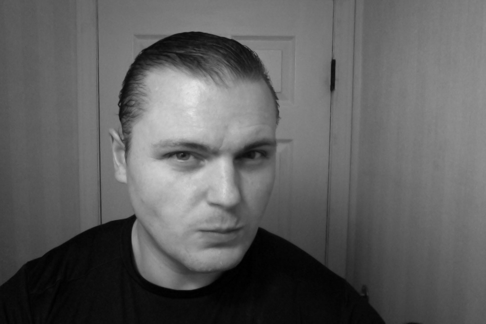
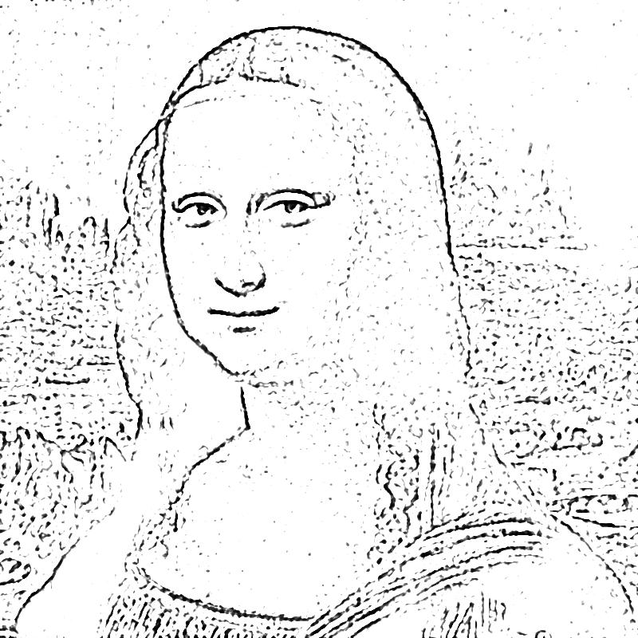
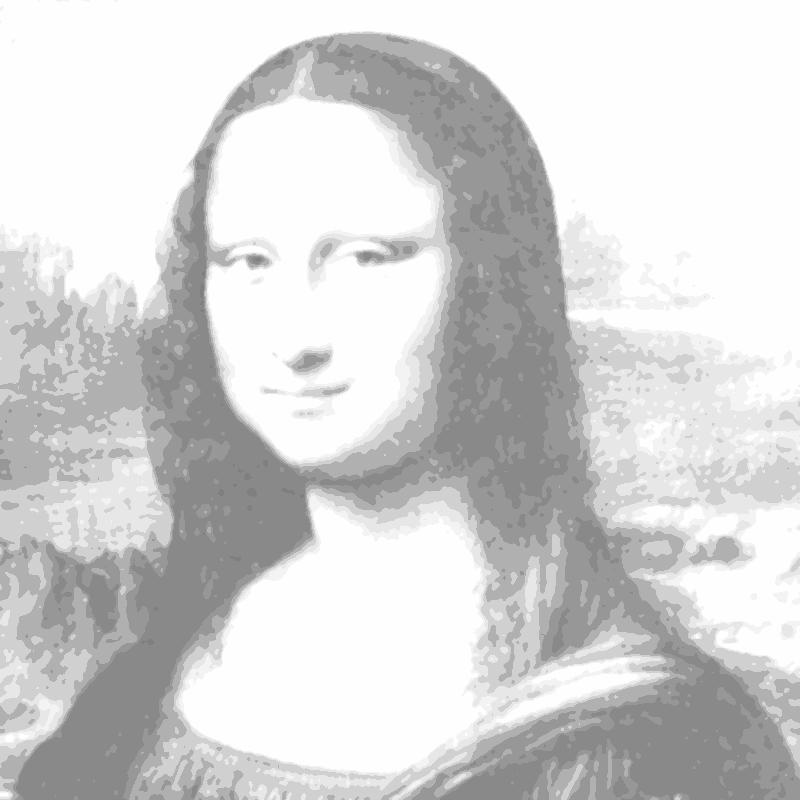
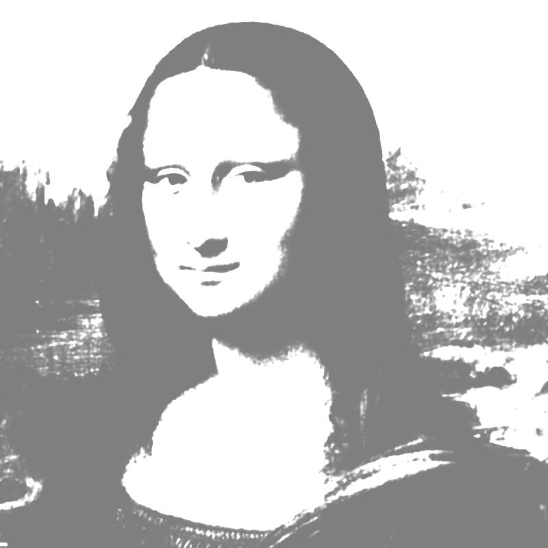
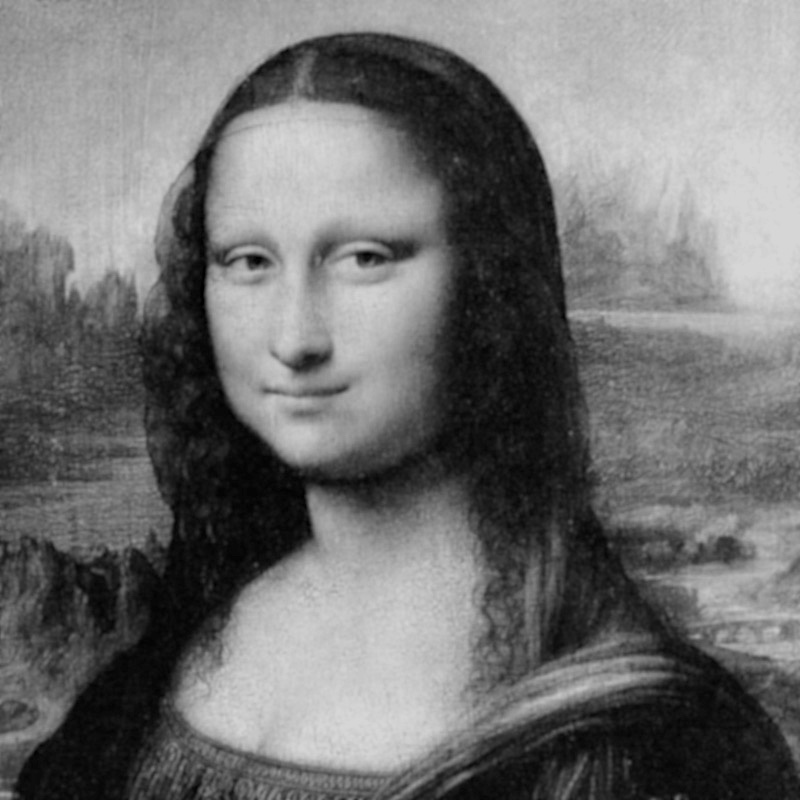
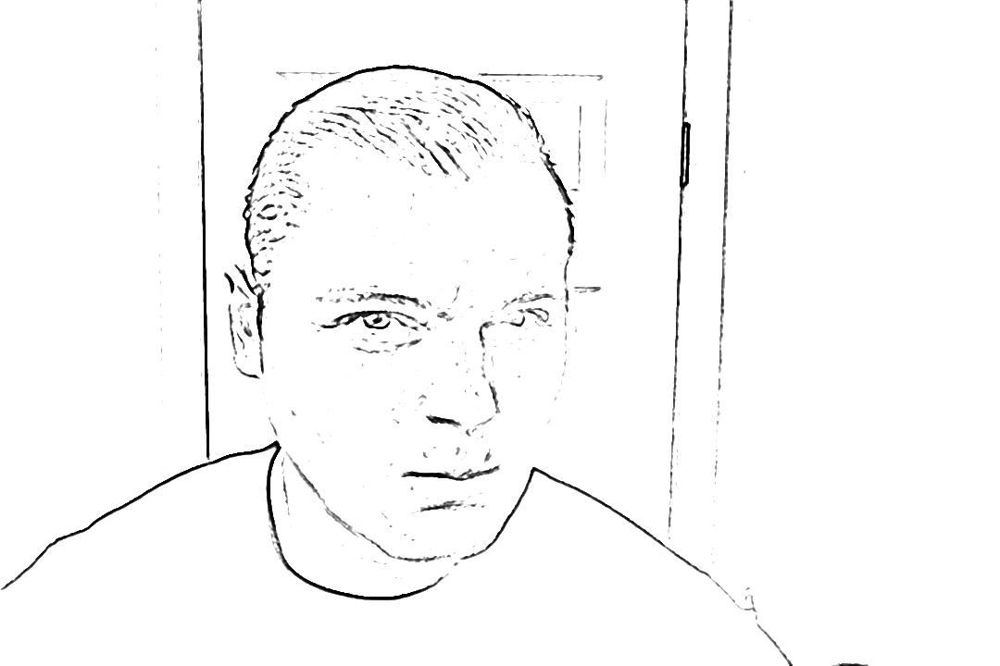
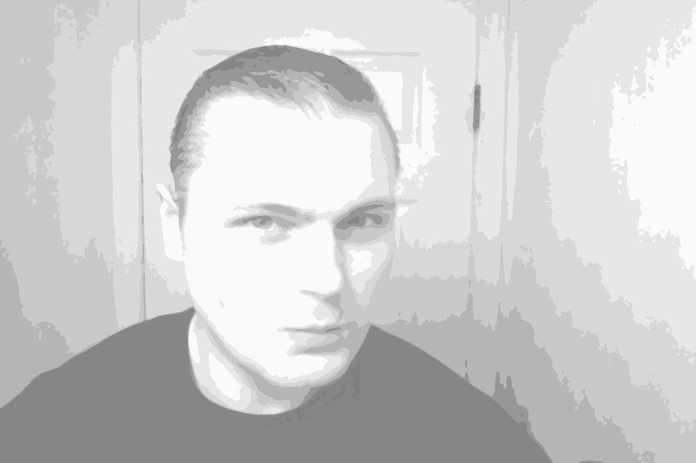
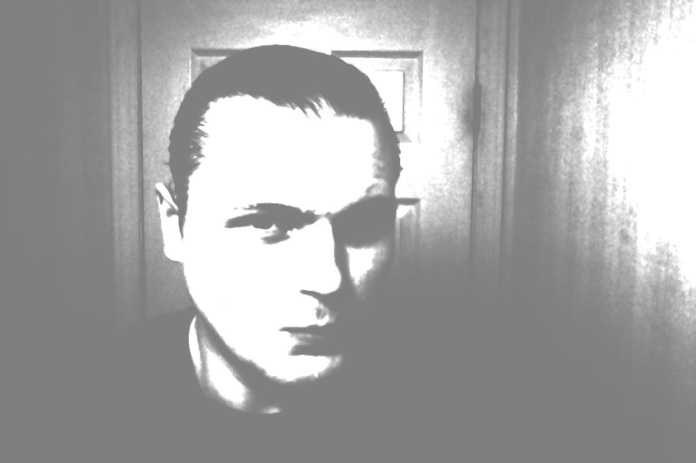

# illustrator
Command line tool to extract drawing information from a photo.

## Results, Photo Decomposition Algorithm

### La Joconde






### Bathroom Selfie






## Before you get started.
1. Your image should be well balanced in terms of contrast, shadows darks. (Take a good portrait photo.)
2. We will be working with pencils, so your image should be Grayscale. (Optional, the program will do it for you.)
3. Apply soft blur to your image, let the blur blur-up what you don't care about (ex wrinkles, textures)


## Installation

```bash

npm install -g illustrator

```

## Usage

```bash

illustrator sketch samples/a.jpg
illustrator sketch samples/?.jpg
illustrator sketch ~/Desktop/samples/*.jpg

```
