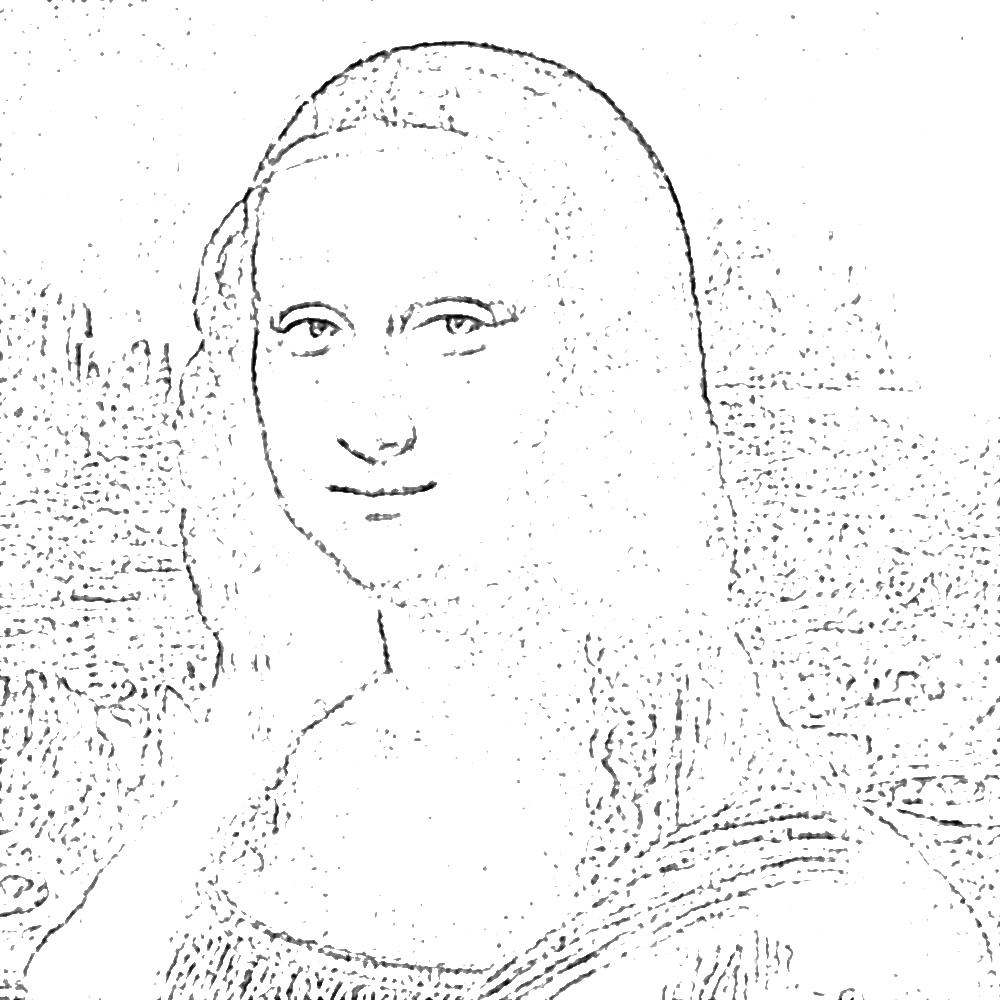
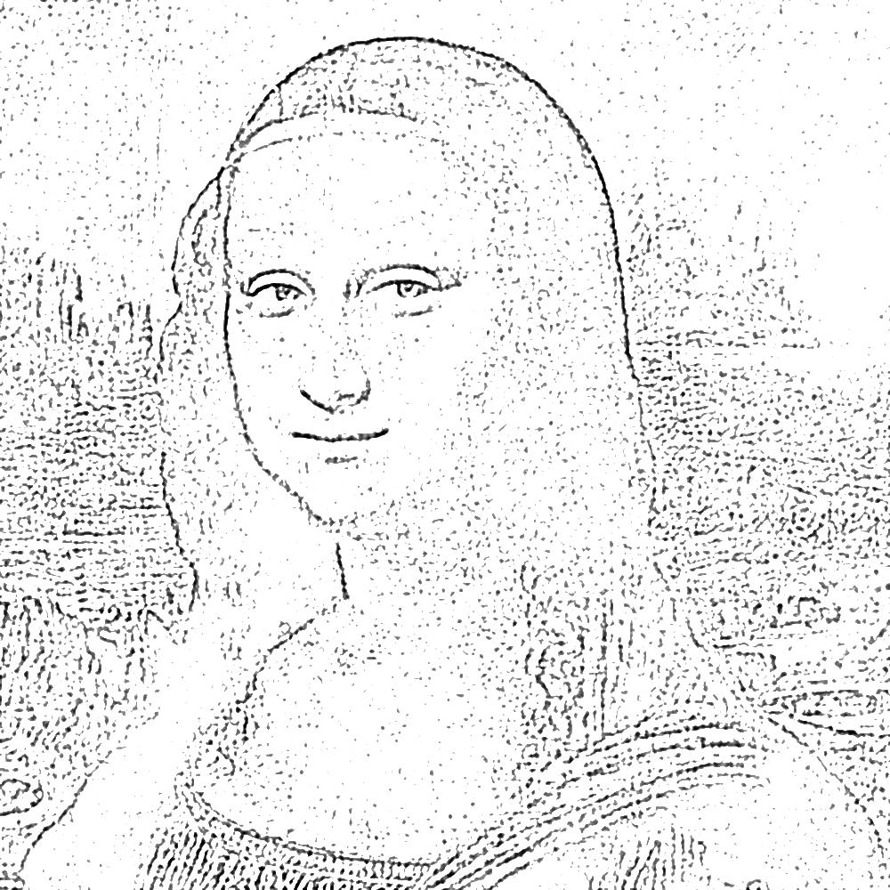
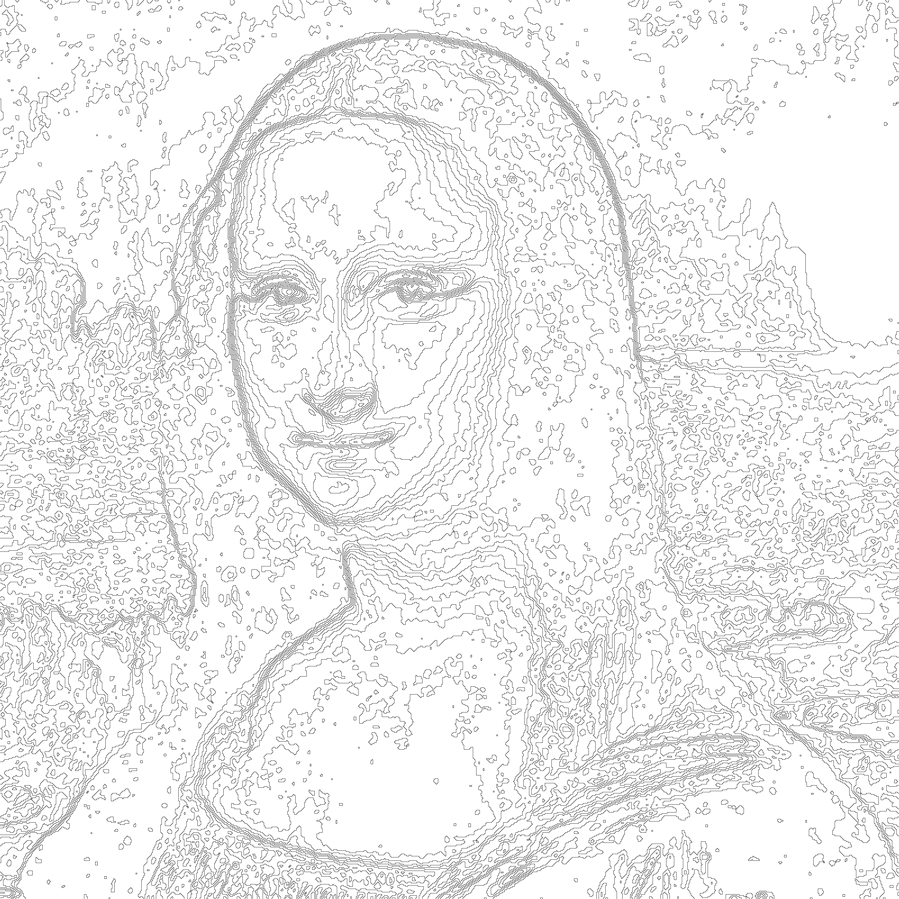
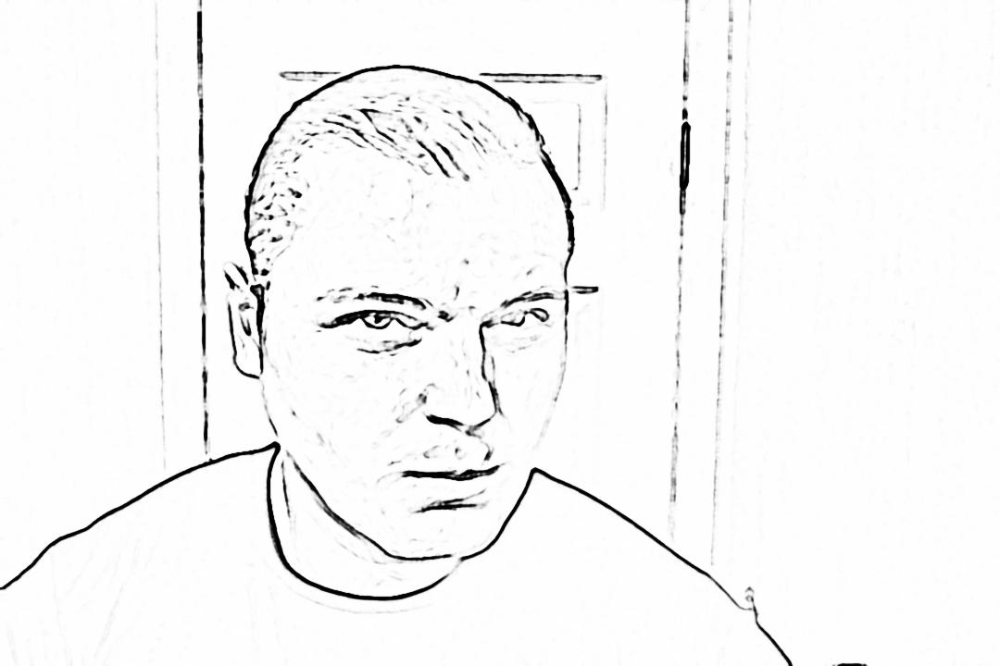

# illustrator
Command line tool to extract drawing reference from a photo and create a pdf formatted drawing reference booklet. A tool for artists of all ages.


Click [Single Image PDF](https://github.com/fantasyui-com/illustrator/blob/master/la-joconde.pdf) or
[Multiple Image PDF](https://github.com/fantasyui-com/illustrator/blob/master/my-album.pdf) for live album examples.

## Results, Photo Decomposition Algorithm

### La Joconde






### Bathroom Selfie





## Before you get started.

1. Your image should be well balanced in terms of contrast, shadows darks. (Take a good portrait photo.)
2. We will be working with pencils, so your image should be Grayscale. (Optional, the program will do it for you.)
3. Apply soft blur to your image, let the blur blur-up what you don't care about (ex wrinkles, textures)


## Installation

```bash

brew install imagemagick;
brew install graphicsmagick;
npm install -g illustrator;

```

## Usage

```bash

illustrator sketch samples/a.jpg

```
### Advanced usage examples

```bash

illustrator sketch samples/?.jpg

illustrator sketch ~/Desktop/samples/*.jpg

illustrator --album samples --unpdf sketch ./samples/a.jpg ./samples/b.jpg

illustrator --album la-joconde sketch ./samples/a.jpg

```

## Next Steps

You will need [Drawing Pencils](https://duckduckgo.com/?q=Drawing+Pencils), [Graphite Paper](https://duckduckgo.com/?q=Graphite+Paper), [Drawing Paper](https://duckduckgo.com/?q=Drawing+Paper), Patience, Love, and, somebody to Love.

Remember,

>  Any time ya learn, ya gain.
>
>   -- Bob Ross

Love,
Dr. M.
